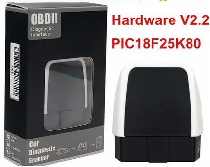
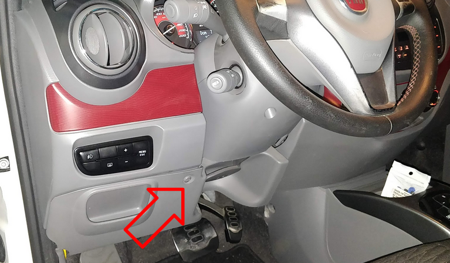
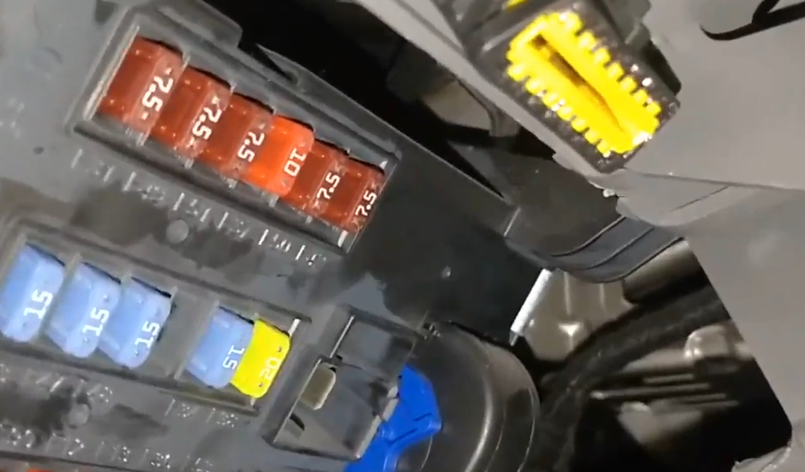
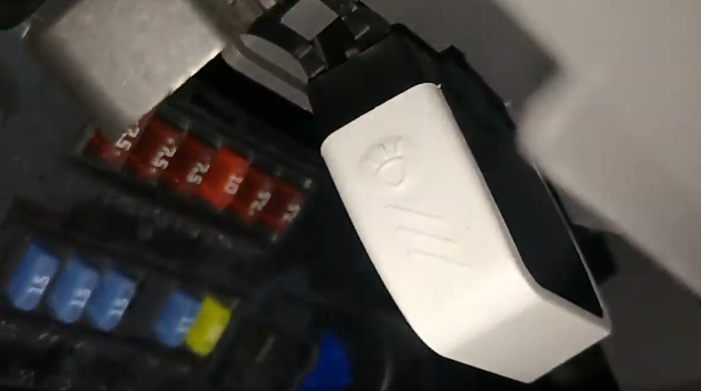
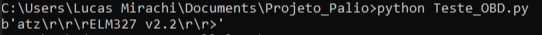

<p align="center">
  
</p>

# Projeto - Conectando um Fiat Palio na Nuvem AWS

## Justificativa

Não é surpresa para ninguém que o mundo do IoT (Internet of Things ou 'Internet das Coisas') já está entre nós. Seja em casa ou na indústria, artigos como lâmpadas acionados pelo seu smartphone, fechaduras inteligentes ou até mesmo sensores para aguar suas plantas de acordo com a temperatura do sol, umidade e claridade do dia já são acessíveis para boa parte dos brasileiros. Diante desta mudança, como um ~~quase~~ Engenheiro Mecânico, eu me pergunto: "Mas e os carros!?".   

Segundo especialistas do IEEE (Instituto de Engenheiros Eletricistas e Eletrônicos), a maior organização professional técnica do mundo, em 2025 cerca de 60% dos carros nas ruas poderão estar conectados à internet e utilizando serviços online. Além disso, segundo o Gartner, são esperados 250 milhões de automóveis conectados à Internet das Coisas (IoT) até 2020 e, somente nos EUA, já circulam mais de 40 milhões de automóveis conectados à IoT, o que representa 15% do montante. 

Montadoras de todo o mundo já realizam investimentos em tecnologias para a transformação de seus carros em veículos inteligentes, incluindo as próprias montadoras brasileiras. Fatalmente, as oportunidades de aprendizado são muito grandes e as possibilidades são enormes, variando desde o monitoramento dos dados fornecidos pelo carro para realização de manutenções preditivadas, direção autônoma e muito mais. Dessa forma, este é um grande momento para o aprendizado destas novas tecnologias emergentes no mercado automotivo. 

## Objetivo

De acordo com Alberto Broggi, membro senior do IEEE e professor da Universidade de Parma, Itália, *"no futuro as pessoas pagarão para dirigir os carros manualmente, do mesmo modo como hoje pagamos por uma corrida de kart"*. Apesar de ser um projeto bem complexo, o princípio de um carro autônomo começa com a obtenção dos dados do veículo para então fazer o processamento e finalmente "fazer o carro dirigir sozinho" de fato.

Por se tratar de um projeto iniciante com o intuito de aprender sobre IoT e veículos conectados, este projeto tem como objetivo se aprender a obter dados em tempo real de um veículo e então armazenar estes dados na nuvem. Com isso, posteriormente será possível realizar outros projetos complementares de nível mais avançado, utilizando-se estes mesmos dados para a criação de um algoritmo de Machine Learning para a previsão da necessidade de manutenção do carro ou até mesmo fazer um indicador para otimização do consumo.

## Metodologia

No dia 06/05/2020, o Desenvolvedor Sênior da Amazon Web Services, Vinicius Senger, participou de uma palestra online da DataSprints (empresa de consultoria de Engenharia e Ciência dos Dados) e apresentou seu projeto de conectar uma Volkswagen Kombi na núvem AWS, promovendo uma série de discussões e ideias imprescindíveis para a realização deste projeto.

[](https://www.youtube.com/watch?v=tqBR3G_eFQc&t=2417s)
<p align="center">
<sub>Para abrir o vídeo no Youtube, clique na imagem!</sub>
</p>

---

Basicamente, o fluxo para a obtenção dos dados em tempo real do veículo deve ser:

**Intalação de um módulo OBDII na central** -> **Obtenção dos dados utilizando um Laptop ou um RaspberryPi** -> **Armazenamento dos dados por rede na AWS**

Diferentemente do apresentado no projeto do Senger e sua Kombi que utiliza um módulo de comunicação OBDII USB, para este projeto, foi utilizado um módulo OBDII com conexão bluetooth (o que adiciona um certo desafio ao projeto, já que sua conexão com o Laptor se torna um pouco mais complexa), como o aparelho das imagens a seguir.

<p align="center">
  
</p>

Para o Fiat Palio Modelo 2014/2015, a entrada do módulo OBDII se localiza em um compartimento abaixo do volante. Para ter acesso, é necessário a remoção de um parafuso e o deslocamento do painel.

<p align="center">
  
</p>

<p align="center">
  
</p>

<p align="center">
  
</p>

## Pareamento do módulo bluetooth com o PC

Para a realização desta etapa, é necessário um entendimento básico de programação em Python. Basicamente, deve-se parear e conectar o módulo OBDII com o computador através das próprias configurações de seu sistema operacional (exatamente como se conecta um teclado ou um fone bluetooth). Em seguida, deve-se identificar qual porta de serial o OBDII está atrelado (no meu caso, é na porta serial 'COM6', que é um dos serial padrão por link Bluetooth disponíveis). 

Para testar se tudo está setado corretamente, deve-se instalar a biblioteca de Python chamada Pyserial (basta dar um **pip install pyserial*** em uma linha de comando) e, em seguida, já podemos entrar com o código:
~~~
import serial
ser = serial.Serial('COM6', 38400, timeout=1, bytesize=8, parity=serial.PARITY_NONE)
# Os principais parâmetros: COM6 = Nome da porta serial usada pelo OBD; 38400 = a frequência de Bits por segundo que 
# o aparelho opera; Timeout = 1 Bit de parada e parity = nenhum (PARITY_NONE).
ser.write("atz\r\n".encode())
print(ser.readline())
~~~

Pronto, se apareceu um output com o nome do OBD2 e sua versão (no meu caso, é um ELM327 versão 2.2) como na imagem, agora teoricamente os equipamentos conseguem trocar informações!
<p align="center">
  
</p>

Mas como fazer para que o OBDII entenda quais informações queremos? Para isso, precisamos aprender sobre os comandos AT e sobre os protocolos de comunicação utilizados por todos os módulos OBDII.

### Aprendendo sobre os protocolos de comunicação dos módulos OBDII


---
# Mais atualizações do projeto em breve!
## Next Steps:
Por algum motivo, estou conseguindo pegar dados sobre as rotações em rpm do motor, sobre a velocidade instantânea do carro e sobre a temperatura do motor em tempo real, mas não estou conseguindo converter para valores legíveis. Ficam aparecendo as mensagens de debug de "valor errado" junto com os dados crus vindos do OBDII. É necessário descobrir o que está ocasionando este erro. Passado este obstáculo, vai ser só armazenar os dados na núvem, o que acredito que será bem tranquilo devido à excelente documentação que a AWS fornece.

<p align="center">
  
</p>

---
# Código utilizado (não definitivo, é necessário arrumar!)
~~~
import serial
import time
ser = serial.Serial('COM6', 38400, timeout=1, bytesize=8, parity=serial.PARITY_NONE)
time.sleep(1)
ser.write("atz\r\n".encode())
print(ser.readline())
rpm = 0
speed = 0
temp = 0
initializing = True
time.sleep(1)

# Import SDK packages
from AWSIoTPythonSDK.MQTTLib import AWSIoTMQTTClient

myMQTTClient = AWSIoTMQTTClient("myClientID-Fiat_Palio")
myMQTTClient.configureEndpoint("ahjysgxc7yc9n-ats.iot.us-west-2.amazonaws.com", 8883)
myMQTTClient.configureCredentials("/home/lucasmirachi/Documents/Car_Reader/connect_device_package/root-CA.crt", "/home/lucasmirachi/Documents/Car_Reader/connect_device_package/Fiat_Palio.private.key", "/home/lucasmirachi/Documents/Car_Reader/connect_device_package/Fiat_Palio.cert.pem")
myMQTTClient.configureOfflinePublishQueueing(-1)  # Infinite offline Publish queueing
myMQTTClient.configureDrainingFrequency(2)  # Draining: 2 Hz
myMQTTClient.configureConnectDisconnectTimeout(10)  # 10 sec
myMQTTClient.configureMQTTOperationTimeout(5)  # 5 sec
myMQTTClient.connect()


while initializing:
	ser.write("010c\r\n".encode())
	r = ser.readline();
	if(r.startswith("010c")):
		initializing= False
	else:
		time.sleep(2)

while True:
	ser.write("010c\r\n".encode())
	rpm_h = ser.readline()
	#print(rpm_h)
	#print(len(rpm_h))
	if(rpm_h.startswith("010c")):
		try:
			rpm_1 = rpm_h[11:13]
			rpm_2 = rpm_h[14:16]
			rpm = int(rpm_1 + rpm_2, 16)/4
			print("rpm " + str(rpm))
		except ValueError:
			print("valor errado")
	else:
		print("bus initializing")
	time.sleep(1)
	ser.write("010d\r\n".encode())
	speed_h = ser.readline()
	#print(speed_h)
	#print(len(speed_h))
	if(speed_h.startswith("010d")):
		try:
			speed_1 = speed_h[11:13]
			speed = int(speed_1, 16)
			print("speed " + str(speed))
		except ValueError:
			print("valor errado")
	else:
		print("bus initializing.")
	time.sleep(1)

	ser.write("0105\r\n".encode())
	temp_h = ser.readline()
	#print(speed_h)
	#print(len(speed_h))
	if(temp_h.startswith("0105")):
		try:
			temp_1 = temp_h[11:13]
			temp = int(temp_1, 16) - 40
			print("temperature " + str(temp))
		except ValueError:
			print("valor errado")
	else:
		print("bus initializing...")


	myMQTTClient.publish("connected_vehicle",'{ "rpm" : ' + str(rpm) + ', "speed" : ' + str(speed) + ',"temperature : ' + str(temp) + '}', 0)
	time.sleep(1)```
  ~~~
